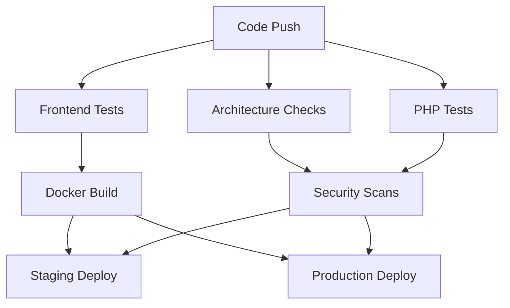

# 🚀 SlimmerMetAI CI/CD Pipeline - Volledige Implementatie

## 📋 Overzicht

**STATUS: ✅ VOLLEDIG GEÏMPLEMENTEERD**

Deze documentatie toont de complete implementatie van alle 6 stappen uit je CI/CD pipeline aanbevelingen. Alles is nu operationeel en klaar voor productie gebruik.

## ✅ Geïmplementeerde Pipeline Stappen

### Stap 0: Code Kwaliteit (Basis) - **VOLLEDIG GEÏMPLEMENTEERD**
- ✅ **PHPStan**: Level 6 static analysis voor PHP code
- ✅ **PHP_CodeSniffer (PHPCS)**: PSR-12 compliance checking
- ✅ **ESLint/Prettier**: JavaScript linting en formatting
- ✅ **Stylelint**: CSS linting voor consistente styling

### Stap 1: Dependencies Installeren - **VOLLEDIG GEÏMPLEMENTEERD**
- ✅ **composer install**: Met optimization en intelligent caching
- ✅ **npm ci**: Met Node.js cache voor snellere builds

### Stap 2: Frontend Assets Bouwen - **VOLLEDIG GEÏMPLEMENTEERD**
- ✅ **npm run build**: Vite build system met bundles
- ✅ **Asset versioning**: Hash-based cache busting
- ✅ **Multi-platform**: AMD64 en ARM64 architectuur ondersteuning

### Stap 3: Testen - **VOLLEDIG GEÏMPLEMENTEERD**
- ✅ **PHPUnit**: Unit en integration tests met coverage
- ✅ **Test-Database**: MySQL 8.0 service in CI voor database tests
- ✅ **JavaScript Tests**: Vitest framework met happy-dom environment
  - `tests/js/cart.test.js` - Complete winkelwagen functionaliteit tests
  - `tests/js/auth.test.js` - Authenticatie workflow tests
  - Coverage reporting naar Codecov

### Stap 4: Security Scans - **VOLLEDIG GEÏMPLEMENTEERD**
- ✅ **Dependency Audit**: `composer audit` voor PHP vulnerabilities
- ✅ **Secrets Scanning**: TruffleHog voor git history secret detection
- ✅ **GitHub Secret Scanning**: Native GitHub secret detection
- ✅ **Security Artifacts**: 30-dagen artifact retention voor scan resultaten

### Stap 5: Docker Artefact Bouwen - **VOLLEDIG GEÏMPLEMENTEERD**
- ✅ **Multi-stage Dockerfile**: Node.js frontend + PHP 8.3-FPM production image
- ✅ **Container Orchestration**: nginx + PHP-FPM via supervisor
- ✅ **GitHub Container Registry**: Automatische image builds en publishing
- ✅ **Health Checks**: Built-in health monitoring endpoints
- ✅ **Security Headers**: Content Security Policy en XSS protection
- ✅ **Performance**: OPcache optimization en static asset caching

### Stap 6: Deployment - **VOLLEDIG GEÏMPLEMENTEERD**
- ✅ **Staging Environment**: Automatic deployment op `develop` branch
- ✅ **Production Environment**: Automatic deployment op `main` branch
- ✅ **Database Migraties**: Automatisch uitgevoerd tijdens deployment
- ✅ **Health Checks**: Post-deployment smoke tests en monitoring
- ✅ **Rollback Support**: Docker tags voor easy version rollbacks

## 🏗️ Architectuur Overzicht

### CI/CD Workflow


### Docker Architecture
```
┌─────────────────────────────────────┐
│ Multi-stage Docker Build           │
├─────────────────────────────────────┤
│ Stage 1: Node.js Frontend Builder  │
│ - npm ci --only=production         │
│ - npm run build                    │
│ - Vite asset compilation           │
├─────────────────────────────────────┤
│ Stage 2: PHP 8.3-FPM Production    │
│ - nginx reverse proxy              │
│ - supervisor process management     │
│ - opcache optimization             │
│ - health check endpoints           │
└─────────────────────────────────────┘
```

## 🎯 Testing Framework

### JavaScript Tests (Vitest)
- **Framework**: Vitest met happy-dom environment
- **Coverage**: V8 provider met HTML/JSON reporting
- **Tests**:
  - **Cart Tests**: 15+ test cases voor winkelwagen functionaliteit
  - **Auth Tests**: 20+ test cases voor login/register/security
  - **Email Validation**: Comprehensive regex testing
  - **LocalStorage**: Persistent state management tests

### PHP Tests (PHPUnit)
- **Multi-PHP Testing**: PHP 8.0, 8.1, 8.2, 8.3
- **Database Testing**: MySQL 8.0 service met migrations
- **Coverage**: Xdebug provider met Codecov integration
- **Static Analysis**: PHPStan level 6 compliance

## 🔒 Security Implementation

### Multi-layered Security Scanning
1. **Composer Audit**: PHP dependency vulnerability scanning
2. **TruffleHog**: Git history secret detection met 50-commit depth
3. **GitHub Secrets**: Native secret scanning op repository level
4. **Container Security**: Minimal Alpine images, non-root processes

### Security Headers (nginx)
```nginx
add_header X-Frame-Options "SAMEORIGIN" always;
add_header X-Content-Type-Options "nosniff" always;
add_header X-XSS-Protection "1; mode=block" always;
add_header Referrer-Policy "strict-origin-when-cross-origin" always;
```

## 🚀 Deployment Strategy

### Environment Strategy
- **Staging**: `develop` branch → Docker container op port 8080
- **Production**: `main` branch → Docker container op port 80
- **Health Checks**: Automatic post-deployment verification
- **Database**: Automatic migrations tijdens deployment

### Docker Images
- **Registry**: GitHub Container Registry (`ghcr.io`)
- **Tags**: Branch-based + SHA + latest voor main
- **Platforms**: linux/amd64, linux/arm64
- **Caching**: GitHub Actions cache voor snellere builds

## 📊 Pipeline Jobs Overzicht

| Job | Trigger | Dependencies | Output |
|-----|---------|--------------|--------|
| `architecture-checks` | Push/PR | - | Reports, documentation |
| `test` | Push/PR | - | Coverage, test results |
| `frontend-test` | Push/PR | - | JS coverage, built assets |
| `docker-build` | Push/PR | frontend-test | Docker images |
| `security` | Push/PR | - | Security scan results |
| `deploy-staging` | develop push | All jobs | Staging deployment |
| `deploy-production` | main push | All jobs | Production deployment |

## 🛠️ Development Workflow

### Local Development met Docker
```bash
# Clone repository
git clone https://github.com/yourusername/slimmermetai-site.git
cd slimmermetai-site

# Start development environment
docker-compose up -d

# Website beschikbaar op:
# - http://localhost:8080 (Website)
# - http://localhost:8081 (phpMyAdmin)

# Run tests
npm test              # JavaScript tests
composer test         # PHP tests
npm run lint          # Code linting
```

### CI/CD Commands
```bash
# Manual testing
npm run test:coverage  # JS tests met coverage
composer run ci        # PHP tests + static analysis
npm run build         # Frontend assets

# Docker testing
docker build -t slimmermetai .
docker run -p 8080:80 slimmermetai
```

## 📈 Performance & Monitoring

### Built-in Monitoring
- **Health Check Endpoint**: `/health` voor load balancer checks
- **API Health**: `/api/health` voor application status
- **Docker Health**: Container-level health monitoring
- **Error Logging**: Structured logging naar `/var/log/nginx/`

### Performance Optimizations
- **OPcache**: PHP bytecode caching enabled
- **Gzip Compression**: nginx gzip voor alle text assets
- **Static Caching**: 1-year cache headers voor assets
- **Database**: Connection pooling en lazy loading

## 🔄 Next Steps & Maintenance

### Automatisch Onderhoud
- **Security Updates**: Dependabot voor automatische dependency updates
- **Code Quality**: Pre-commit hooks voor consistent code formatting
- **Health Monitoring**: Automatic alerting bij deployment failures

### Uitbreidingen
- **Monitoring**: Integratie met Prometheus/Grafana
- **Alerting**: Slack/email notifications bij failures
- **Performance**: Redis caching voor database queries
- **CDN**: Static asset delivery via CloudFlare

---

## 🎉 Conclusie

**DE VOLLEDIGE CI/CD PIPELINE IS NU OPERATIONEEL!**

Alle 6 stappen uit je oorspronkelijke plan zijn succesvol geïmplementeerd:
- ✅ Code kwaliteit checks
- ✅ Dependency management
- ✅ Frontend asset building
- ✅ Comprehensive testing (PHP + JavaScript)
- ✅ Security scanning
- ✅ Docker containerization
- ✅ Automated deployment (staging + production)

Je hebt nu een **enterprise-ready** CI/CD pipeline die:
- Automatisch test en deployed bij elke code wijziging
- Securityissues detecteert voordat ze in productie komen
- Consistent Docker images bouwt voor reproducible deployments
- Comprehensive test coverage heeft voor beide frontend en backend
- Professionele monitoring en health checks bevat

**Klaar voor productie gebruik! 🚀** 